# Chocolate Firm Requirement specificatie

**Team Vellin**

---

# Inhoudsopgave

1. Organisatorische Context
2. Actoren
3. Bedrijfsprocesanalyse
4. Productvisie
5. User Stories
6. Definition of Ready & Definition of Done
7. Sitemap
8. Wireframes
9. MMM-labels

---

# 1. Organisatorische Context

Dit hoofdstuk beschrijft de missie, visie, strategie en doelstellingen van de Chocolate Firm, specifiek gericht op de ontwikkeling van de mobiele applicatie. De organisatorische context vormt de basis voor alle keuzes in dit document.

## 1.1 Missie

Wij maken chocoladeproducten die mensen verbinden met smaak, kwaliteit en duurzaamheid.

**Motto:** Van boon tot reep, met passie voor elk product.

## 1.2 Visie

De Chocolate Firm wil de meest klantgerichte chocoladeproducent zijn, erkend om innovatieve digitale dienstverlening, transparantie en duurzame productie. De mobiele applicatie is het directe instrument waarmee deze visie werkelijkheid wordt: klanten krijgen via één centraal platform toegang tot productinformatie, bestellingen en klantenservice.

## 1.3 Strategie

De Chocolate Firm richt zich op drie strategische punten, elk direct gekoppeld aan de mobiele applicatie:

- **Interne processen digitaliseren:** orders worden centraal verwerkt via de app en het ERP-systeem, voorraden zijn real-time inzichtelijk en de kwaliteitscontrole wordt structureel vastgelegd. Dit elimineert de huidige problemen met handmatige orderverwerking via losse Excel-bestanden, het ontbreken van real-time voorraadinzicht en de gebrekkige kwaliteitscontrole.

- **Directe digitale klantrelatie via de app:** de app is het primaire contactpunt tussen klant en Chocolate Firm. Klanten registreren producten, dienen klachten in, plaatsen bestellingen en ontvangen persoonlijke communicatie binnen één platform. Dit lost de huidige situatie op waarbij klanten geen centraal overzicht hebben en klantenservicemedewerkers geen klantgeschiedenis kunnen inzien.

- **Duurzame groei:** door transparantie over cacaoherkomst, Fairtrade-certificering en B2C-abonnementen via de app wordt een nieuwe groep bewuste consumenten bereikt en de merkpositie versterkt.

## 1.4 Doelstellingen

De Chocolate Firm stelt vier concrete doelstellingen:

- Binnen twaalf maanden na de lancering van de mobiele app heeft minimaal 30% van de actieve klanten hun producten geregistreerd in de app.
- Binnen zes maanden na implementatie van het nieuwe orderverwerkingssysteem zijn handmatige orderfouten met 50% verminderd ten opzichte van de huidige situatie.
- De klantentevredenheid, gemeten via de Net Promoter Score, stijgt van de huidige baseline naar een score van minimaal +30 aan het einde van 2026.
- Binnen achttien maanden na het uitbrengen van de app wordt minimaal 15% van alle orders via het digitale app-kanaal geplaatst.

## 1.5 Organogram

Onderstaand organogram toont de structuur van de Chocolate Firm.

|  |  | Raad van Commissarissen |  |  |
| --- | --- | --- | --- | --- |
|  |  | Managementteam (CEO) |  |  |
| Verkoop en marketing | Productie en logistiek | Inkoop en Voorraad | Klantenservice | Financiën |

## 1.6 Stakeholderanalyse

De stakeholderanalyse is gericht op de impact van de mobiele applicatie. Per stakeholder is aangegeven wat hun belang bij de app is en welk risico zij vormen voor het project.

Bron: https://husite.nl/open-ict/sdgs-bij-open-ict/sdg-toolbox/stakeholderanalyse/

### Directe stakeholders

| Stakeholder | Rol | Impact | Belang bij de app | Risico voor het project |
| --- | --- | --- | --- | --- |
| Raad van Commissarissen | Opdrachtgever | Hoog | Heeft besloten dat alle bedrijven onder de Chocolate Firm een innovatieve mobiele app moeten ontwikkelen die de klantervaring verbetert en klantloyaliteit versterkt | Kan te hoge verwachtingen stellen of tempo forceren |
| Managementteam | Dagelijkse aansturing en beslissingen | Hoog | Gebruikt app-data en BI-koppeling voor betere beslissingen over verkoop en productie | Te veel druk bij het gelijktijdig veranderen en uitvoeren van dagelijkse operatie |
| Klantenservicemedewerkers | Interne app-gebruiker | Hoog | Krijgen via de app een volledig klantprofiel zodat ze klachten sneller en beter kunnen afhandelen | Moeite bij omschakeling naar nieuw systeem |
| Verkoopmedewerkers | Gebruiker | Hoog | Orders lopen straks via de app in plaats van losse Excel-bestanden | Moeite met loslaten van eigen manier van werken |
| IT-team / Ontwikkelaars | Bouwers en beheerders | Hoog | Verantwoordelijk voor het bouwen van de app en de koppelingen met ERP, CRM en BI | Technische kennis gaat verloren als medewerkers vertrekken |

### Indirecte stakeholders

| Stakeholder | Rol | Impact | Belang bij de app | Risico voor het project |
| --- | --- | --- | --- | --- |
| B2C klanten | Eindgebruiker van de app | Midden | Willen eenvoudig productinformatie, bestellingen en klachten regelen via één platform | Lage adoptie als de app niet intuïtief genoeg is |
| B2B klanten (supermarkten, groothandels, speciaalzaken) | Bestellers via de app | Hoog | Willen real-time inzicht in voorraad en levertijden en direct kunnen bestellen zonder tussenkomst van een medewerker | Onzekerheid over betrouwbaarheid van het nieuwe systeem |
| Leveranciers | Partner | Midden | Profiteren van betere voorraadplanning doordat de app gekoppeld is aan het ERP-systeem | Leveringsrisico als voorraaddata niet klopt |

### Kwaadwillende stakeholders

| Stakeholder | Type dreiging | Impact | Risico voor de app |
| --- | --- | --- | --- |
| Concurrenten | Marktpartijen | Hoog | Kunnen klanten weglokken als de app traag is of minder functionaliteiten biedt dan vergelijkbare platformen |
| Cybercriminelen | Externe bedreiging | Hoog | Kunnen klantdata, betalingsgegevens of het systeem aanvallen. Daarom heeft de app end-to-end encryptie en tweefactorauthenticatie |
| Nep-reviewers | Externe bedreiging | Laag | Kunnen via de app of sociale media valse negatieve reviews plaatsen en het vertrouwen in de app schaden |

## UI-model

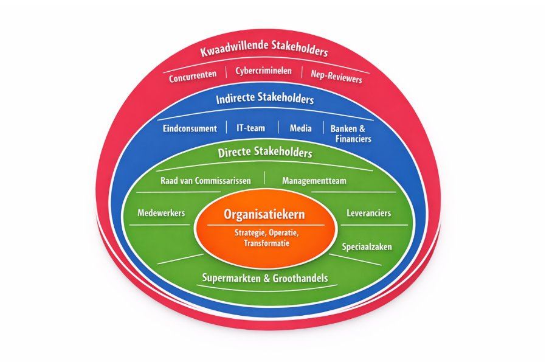

---

# 2. Actoren

Dit hoofdstuk beschrijft alle actoren die een rol spelen in de mobiele applicatie van de Chocolate Firm.

## 2.1 Interne actoren

| Actor | Rol in de app | Wat doet de app voor hen |
| --- | --- | --- |
| Klantenservicemedewerker | Behandelt klachten via de app | Heeft toegang tot klantprofiel en klachthistorie via CRM-koppeling. Hoeft niet meer steeds dezelfde vragen te stellen |
| Verkoopmedewerkers | Beheert B2B-bestellingen | Ziet orders die binnenkomen via de app in plaats van losse Excel-bestanden. Minder handmatig werk |
| Marketingteam | Beheert pushberichten en promoties | Kan via de app gepersonaliseerde berichten sturen op basis van aankoopgeschiedenis van klanten |
| Productieplanner | Ontvangt orders via ERP-koppeling | Krijgt automatisch actuele orderdata binnen. Hoeft niet meer te zoeken naar de juiste versie van een bestand |
| Magazijnmedewerker | Voorraadinzicht via ERP | Voorraad wordt real-time bijgehouden via de app-koppeling. Geen handmatige logboeken meer nodig |

## 2.2 Externe actoren

| Actor | Type | Rol in de app | Wat doet de app voor hen |
| --- | --- | --- | --- |
| B2C klant | Eindgebruiker | Registreert producten, volgt bestellingen, dient klachten in en chat met de AI-chatbot | Heeft alle productinformatie en diensten op één plek. Geen telefoon of e-mail meer nodig |
| B2B klant (supermarkt, groothandel) | Zakelijke gebruiker | Plaatst bulkorders, bekijkt voorraadstatus en productieplanning | Kan zelfstandig bestellen zonder te wachten op een verkoopmedewerker |
| B2B klant (speciaalzaak) | Zakelijke gebruiker | Plaatst kleine orders via de app in plaats van telefonisch | Sneller en eenvoudiger bestellen |
| Transportpartner | Partner | Ontvangt verzendopdrachten via het gekoppelde trackingsysteem | Minder fouten door automatische labels en track & trace |

## 2.3 Systeem actoren

| Actor | Type | Rol |
| --- | --- | --- |
| CRM-systeem | Software | Levert klantprofielen en interactiegeschiedenis aan de app zodat communicatie gepersonaliseerd is |
| ERP-systeem | Software | Ontvangt orders vanuit de app en levert real-time voorraad- en levertijdinformatie terug |
| BI-tool | Software | Analyseert gebruikersgedrag en aankoopdata uit de app voor productontwikkeling en marketing |
| AI-chatbot | Software | Beantwoordt 24/7 klantvragen via de app op basis van CRM-gegevens |
| Trackingsysteem | Software | Koppelt verzendstatus aan de app zodat klanten hun bestelling kunnen volgen |

### Grootste problemen die de app oplost voor de actoren

- B2C- en B2B-klanten hadden geen centraal platform voor productinformatie, bestellingen en klachten.
- Klantenservicemedewerkers hadden geen klantoverzicht waardoor ze inefficiënt werkten.
- Verkoopmedewerkers werkten met losse Excel-bestanden zonder vaste afspraken.
- Productieplanners werkten met verouderde en incomplete orderdata.
- Magazijnmedewerkers hadden geen real-time inzicht in de voorraad.

---

# 3. Bedrijfsprocesanalyse

In dit hoofdstuk wordt de huidige situatie van de Chocolate Firm geanalyseerd. Er wordt gekeken naar hoe processen nu verlopen, welke knelpunten daarin zitten en hoe de nieuwe mobiele applicatie deze problemen oplost. Het verschil tussen de huidige en gewenste situatie wordt tot slot samengevat in een GAP-analyse en uitgewerkt in een SIPOC.

## 3.1 IST-situatie

Binnen de Chocolate Firm verlopen de bedrijfsprocessen op dit moment nog grotendeels handmatig. Bestellingen komen binnen via verschillende kanalen. Grote supermarkten mailen hun orders in bulk, kleinere speciaalzaken bestellen vaak telefonisch en vertegenwoordigers noteren orders onderweg in eigen Excel-bestanden. Elke medewerker werkt daarin op zijn eigen manier zonder vaste afspraken. Dit leidt regelmatig tot discussies over welke versie van een bestand de juiste is.

Aan het einde van de dag worden de bestanden doorgestuurd naar de productieafdeling en het magazijn. Dit gebeurt niet altijd op tijd. Sommige medewerkers sturen bestanden pas de volgende ochtend of vergeten dit helemaal. Soms raken bestanden zoek in de e-mailstroom of komen ze dubbel binnen. De productieplanner moet dan zelf uitzoeken welke versie klopt.

De productieplanning wordt handmatig opgesteld op basis van de ontvangen bestanden. Hierbij wordt geen rekening gehouden met de actuele voorraden. Dit leidt soms tot stilstand van de productielijn omdat een ingrediënt ontbreekt of juist tot overproductie waarbij grote partijen onverkocht in het magazijn blijven liggen.

Het voorraadbeheer gebeurt met de hand via logboeken in het magazijn. Bij drukte wordt dit niet altijd meteen bijgewerkt, waardoor de gegevens soms dagen achterlopen. Er is geen real-time inzicht in de werkelijke voorraad. Bestellingen bij leveranciers worden ongepland geplaatst op basis van wat iemand in de logboeken ziet.

De kwaliteitscontrole is steekproefsgewijs. Bij elke batch wordt een kleine selectie getest. Omdat de productie soms achterloopt, schiet dit er regelmatig bij in. Fouten worden daardoor vaak pas ontdekt nadat producten al naar klanten zijn verstuurd.

Verzendlabels worden grotendeels met de hand geschreven of oude sjablonen worden hergebruikt. Dit leidt regelmatig tot fouten met adressen of ordernummers en dus verkeerde leveringen. Klanten hebben geen toegang tot track & trace informatie.

Facturatie gebeurt handmatig op basis van kopieën van orders en leverbonnen. Er is geen systeem dat automatisch bijhoudt of facturen zijn betaald. Hierdoor blijven facturen regelmatig te lang openstaan.

De klantenservice ontvangt dagelijks vragen en klachten over te late leveringen, verkeerde producten of kwaliteitsproblemen. Er is geen centraal systeem met klantgegevens of eerdere interacties. Medewerkers moeten daardoor steeds opnieuw dezelfde vragen stellen en klachten worden vaak afzonderlijk opgelost zonder structurele verbetering.

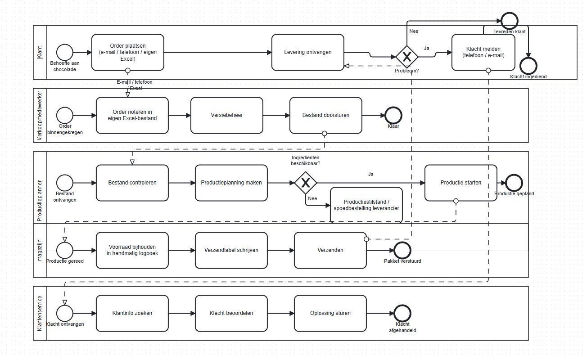

## 3.2 Knelpunten

- **Geen centrale orderverwerking:** Bestellingen komen binnen via e-mail, telefoon en Excel-bestanden zonder vaste afspraken. Dit zorgt voor verwarring, dubbele versies en fouten in de verwerking.
- **Onbetrouwbare informatiedoorstroming:** Bestanden worden niet altijd op tijd doorgestuurd naar de productieafdeling. Hierdoor werkt de planner met incomplete of verouderde informatie.
- **Geen real-time voorraadinzicht:** Het voorraadbeheer loopt via handmatige logboeken die niet altijd actueel zijn. Dit leidt tot tekorten op de productielijn of juist overproductie.
- **Gebrekkige kwaliteitscontrole:** Door tijdsdruk wordt de kwaliteitscontrole soms overgeslagen. Fouten worden pas ontdekt nadat producten al zijn verstuurd.
- **Foutgevoelig logistiek proces:** Handmatig geschreven verzendlabels leiden tot verkeerde leveringen. Klanten hebben geen inzicht in de status van hun bestelling.
- **Handmatige facturatie zonder opvolging:** Facturen worden handmatig opgesteld en er is geen systeem dat bijhoudt of ze zijn betaald. Hierdoor blijven openstaande facturen te lang liggen.
- **Geen centraal klantoverzicht:** De klantenservice heeft geen toegang tot klantgeschiedenis of eerdere interacties. Klanten worden daardoor niet consistent geholpen en klachten worden niet structureel opgelost.

## 3.3 SOLL-situatie

De mobiele app lost de bovenstaande knelpunten direct op. Hieronder staat per knelpunt hoe de app dit aanpakt.

In de nieuwe situatie is er één centrale mobiele app voor alle klantprocessen. Klanten registreren hun producten via een QR-code of handmatige invoer. Via een persoonlijk dashboard zien ze direct alle productinformatie, zoals allergenen, herkomst, certificeringen en houdbaarheid.

Klachten worden ingediend via een eenvoudig formulier in de app. Klanten kunnen er foto's of video's bij sturen. De app herkent veelvoorkomende problemen automatisch en biedt direct een oplossing of compensatie aan. Klanten kunnen de status van hun klacht live volgen en krijgen een bericht bij elke update.

Klanten bestellen nieuwe producten direct via de app. De app is gekoppeld aan het ERP-systeem, zodat voorraad en levertijden altijd actueel zijn. Een medewerker is hier niet meer voor nodig.

Communicatie is persoonlijk. Klanten krijgen pushberichten over producten die passen bij hun eerdere aankopen en voorkeuren. Ze stellen zelf in welk soort berichten ze willen ontvangen.

ERP, BI en CRM zijn gekoppeld aan de app. Data wordt automatisch gesynchroniseerd. Medewerkers hebben altijd een volledig en actueel klantprofiel beschikbaar.

Een AI-chatbot is 24/7 beschikbaar voor vragen over producten, allergenen, bestellingen en klachten. Bij ingewikkeldere vragen kunnen klanten live chatten met een medewerker of een terugbelverzoek indienen.

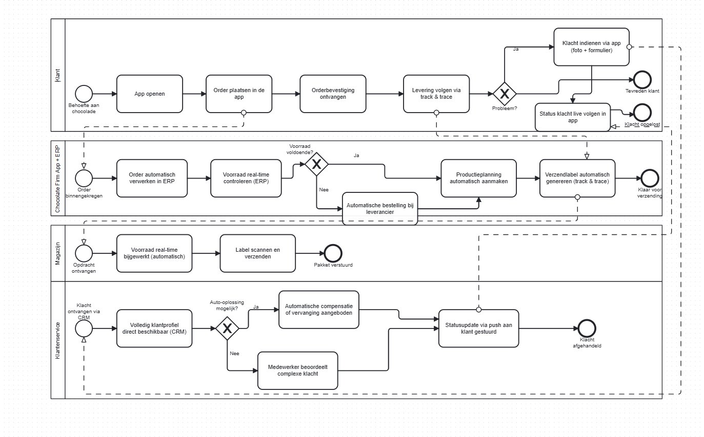

## 3.4 GAP-analyse

| Aspect | IST | SOLL | GAP |
| --- | --- | --- | --- |
| Orderverwerking | Losse kanalen, Excel-bestanden per medewerker | Centrale digitale orderverwerking via app en ERP | Gestandaardiseerd digitaal orderproces bouwen |
| Informatiedoorstroming | Bestanden worden te laat of niet doorgestuurd | Automatische synchronisatie van orders naar productie | ERP-koppeling realiseren |
| Voorraadbeheer | Handmatige logboeken, geen real-time inzicht | Real-time voorraadinzicht via gekoppeld systeem | Voorraadbeheermodule koppelen aan ERP |
| Kwaliteitscontrole | Steekproefsgewijs, wordt soms overgeslagen | Gestructureerde kwaliteitscontrole per batch | Digitaal kwaliteitscontroleproces inrichten |
| Logistiek | Handgeschreven labels, geen track & trace | Automatische labels en track & trace voor klanten | Logistieke module bouwen met track & trace |
| Facturatie | Handmatig, geen automatische opvolging | Automatische facturatie en betalingsopvolging | Facturatiemodule koppelen aan ERP |
| Klantenservice | Geen centraal klantoverzicht | Centraal CRM met volledige klantgeschiedenis | CRM implementeren en koppelen aan app |

## 3.5 SIPOC (Klachtenproces)

| Suppliers | Inputs | Process | Outputs | Customers |
| --- | --- | --- | --- | --- |
| Klant, ERP, CRM | Klachtomschrijving, foto/video, productcode, aankoopgegevens | 1. Klant dient klacht in via app 2. App herkent het probleemtype 3. Directe oplossing of doorverwijzing 4. Medewerker beoordeelt indien nodig 5. Klant krijgt statusupdates 6. Klacht wordt afgehandeld | Opgeloste klacht, statusupdates, compensatie of vervanging, data voor kwaliteitsverbetering | Klant, klantenservice, kwaliteitsafdeling, productontwikkeling |

---

# 4. Productvisie

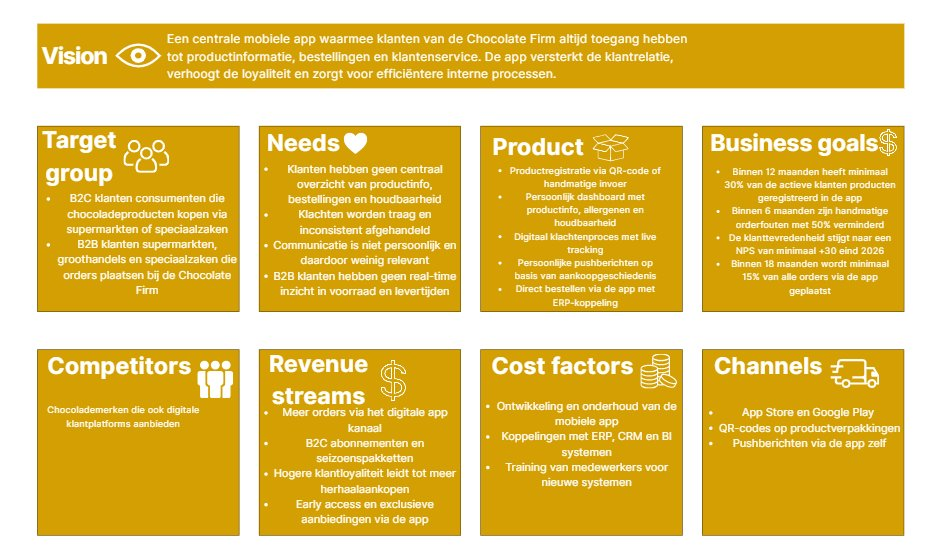

---

# 5. User stories

In dit hoofdstuk worden de functionele en niet-functionele eisen van de mobiele app uitgewerkt in user stories. Elke user story beschrijft wat een gebruiker wil, waarom hij dat wil en wanneer de story als klaar wordt beschouwd via de acceptatiecriteria. De stories zijn geprioriteerd op basis van de doelstellingen en knelpunten uit de bedrijfsprocesanalyse.

De inschatting wordt gedaan in story points. Story points geven aan hoe complex en tijdrovend een taak is. Als richtlijn hanteert het team het volgende:

- 1 story point = zeer eenvoudige taak, ongeveer 2 uur werk
- 2 story points = eenvoudige taak, ongeveer 4 uur werk
- 3 story points = gemiddelde taak, ongeveer 1 dag werk
- 5 story points = complexe taak, ongeveer 2–3 dagen werk
- 8 story points = zeer complexe taak, ongeveer 1 week werk

De prioriteit wordt bepaald aan de hand van de MoSCoW-methode.

User stories gemarkeerd met een ★ maken deel uit van het MVP. Functionele MVP stories (F01, F02, F03, F04 en F06) zijn uitgewerkt in wireframes. Niet-functionele MVP stories (NF08 en NF09) zijn ook onderdeel van het MVP maar krijgen geen wireframe omdat het technische eisen zijn die op de achtergrond werken en niet zichtbaar zijn als scherm. De overige stories worden in een latere versie opgepakt.

---

| **ID** | **F01** ★ |
| --- | --- |
| **Naam** | Productregistratie via QR-code |
| **Omschrijving** | Als klant wil ik mijn chocoladeproduct registreren via een QR-code op de verpakking zodat ik direct toegang heb tot alle productinformatie in de app. |
| **Acceptatiecriteria** | - De camera van de app herkent de QR-code op de verpakking - Na scannen wordt het product automatisch toegevoegd aan het dashboard - Als de QR-code niet werkt kan de klant handmatig een batchnummer of productcode invoeren - Het geregistreerde product toont aankoopdatum, houdbaarheid, allergenen, herkomst en certificeringen |
| **Inschatting** | 5 story points |
| **Prioriteit** | Must have |

---

| **ID** | **F02** ★ |
| --- | --- |
| **Naam** | Persoonlijk dashboard |
| **Omschrijving** | Als klant wil ik een persoonlijk dashboard zien met al mijn geregistreerde producten zodat ik snel alle productinformatie op één plek kan vinden. |
| **Acceptatiecriteria** | - Het dashboard toont alle geregistreerde producten met aankoopdatum en houdbaarheid - De klant ziet per product de allergenen, herkomst en certificeringen zoals Fairtrade - Het dashboard is beschikbaar in Nederlands en Engels - Het dashboard werkt zowel in lichte als donkere modus |
| **Inschatting** | 5 story points |
| **Prioriteit** | Must have |

---

| **ID** | **F03** ★ |
| --- | --- |
| **Naam** | Klacht indienen via de app |
| **Omschrijving** | Als klant wil ik een klacht indienen via een formulier in de app zodat ik snel en eenvoudig een probleem kan melden zonder te hoeven bellen of mailen. |
| **Acceptatiecriteria** | - De klant kan een klacht indienen via een formulier met foto of video als bijlage - De app herkent automatisch veelvoorkomende problemen zoals smeltschade of breukschade - De klant ontvangt direct een bevestiging van de melding - De klant kan de status van de klacht live volgen in de app - De klant krijgt een pushbericht bij elke statuswijziging |
| **Inschatting** | 8 story points |
| **Prioriteit** | Must have |

---

| **ID** | **F04** ★ |
| --- | --- |
| **Naam** | Direct bestellen via de app |
| **Omschrijving** | Als klant wil ik nieuwe producten direct bestellen via de app zodat ik niet afhankelijk ben van een verkoopmedewerker of extern portaal. |
| **Acceptatiecriteria** | - De klant kan producten bestellen via de app - De voorraad en levertijden zijn altijd actueel dankzij de koppeling met het ERP-systeem - B2B-klanten zien aanvullende informatie over productieplanning en voorraadstatus - De klant ontvangt een orderbevestiging via de app na het plaatsen van een bestelling |
| **Inschatting** | 8 story points |
| **Prioriteit** | Must have |

---

| **ID** | **F05** |
| --- | --- |
| **Naam** | Persoonlijke pushberichten ontvangen |
| **Omschrijving** | Als klant wil ik persoonlijke pushberichten ontvangen over producten die bij mij passen zodat ik relevante aanbiedingen en nieuwe producten niet mis. |
| **Acceptatiecriteria** | - De app stuurt pushberichten op basis van aankoopgeschiedenis en voorkeuren - De klant kan zelf instellen welk type berichten hij wil ontvangen, zoals alleen duurzame producten of alleen nieuwe smaken - De klant kan niet-storenperiodes instellen - Berichten worden verstuurd bij nieuwe smaken, limited editions en seizoensproducten |
| **Inschatting** | 5 story points |
| **Prioriteit** | Should have |

---

| **ID** | **F06** ★ |
| --- | --- |
| **Naam** | AI-chatbot gebruiken voor vragen |
| **Omschrijving** | Als klant wil ik 24/7 vragen stellen via een AI-chatbot zodat ik altijd snel antwoord krijg zonder te hoeven wachten op een medewerker. |
| **Acceptatiecriteria** | - De chatbot is 24/7 beschikbaar en beantwoordt vragen over producten, allergenen, bestellingen en klachten - Antwoorden zijn gepersonaliseerd op basis van CRM-gegevens van de klant - Bij complexere vragen kan de klant doorverbonden worden met een live medewerker tijdens openingstijden - De klant kan ook een terugbelverzoek indienen via de app |
| **Inschatting** | 8 story points |
| **Prioriteit** | Should have |

---

| **ID** | **F07** |
| --- | --- |
| **Naam** | Notificatie bij bijna verlopen product |
| **Omschrijving** | Als klant wil ik automatisch een melding ontvangen als een product bijna over de datum raakt zodat ik het product op tijd kan gebruiken en verspilling voorkom. |
| **Acceptatiecriteria** | - De app stuurt automatisch een pushbericht wanneer een product binnen 7 dagen over de datum raakt - De melding toont de productnaam en de houdbaarheidsdatum - De klant kan instellen of hij dit soort meldingen wil ontvangen - De melding is beschikbaar in de taal die de klant heeft ingesteld |
| **Inschatting** | 3 story points |
| **Prioriteit** | Could have |

---

| **ID** | **NF08** ★ |
| --- | --- |
| **Naam** | Beveiliging en privacy |
| **Omschrijving** | Als klant wil ik dat mijn gegevens veilig worden opgeslagen en verwerkt zodat ik erop kan vertrouwen dat mijn persoonlijke informatie niet in verkeerde handen valt. |
| **Acceptatiecriteria** | - Alle dataoverdracht is beveiligd met end-to-end encryptie - De klant kan inloggen met tweefactorauthenticatie - De klant kan zelf instellen welke gegevens worden verzameld en hoe deze worden gebruikt - De klant wordt transparant geïnformeerd over wijzigingen in het privacybeleid |
| **Inschatting** | 8 story points |
| **Prioriteit** | Must have |

---

| **ID** | **NF09** ★ |
| --- | --- |
| **Naam** | Prestaties en betrouwbaarheid |
| **Omschrijving** | Als klant wil ik dat de app snel laadt en weinig uitvalt zodat ik altijd gebruik kan maken van de app zonder frustratie. |
| **Acceptatiecriteria** | - Pagina's laden binnen 2 seconden - De app heeft minimale downtime en is vrijwel altijd beschikbaar - Bij een fout krijgt de klant een duidelijke foutmelding en geen lege pagina - De app werkt stabiel op zowel iOS als Android |
| **Inschatting** | 5 story points |
| **Prioriteit** | Must have |

---

| **ID** | **NF10** |
| --- | --- |
| **Naam** | Toegankelijkheid |
| **Omschrijving** | Als klant met een visuele beperking wil ik de app kunnen gebruiken met een schermlezer en grotere letters zodat ik dezelfde ervaring heb als andere gebruikers. |
| **Acceptatiecriteria** | - De app ondersteunt schermlezers voor slechtzienden - Lettergroottes zijn aanpasbaar door de klant - Alle video's in de app hebben ondertiteling |
| **Inschatting** | 5 story points |
| **Prioriteit** | Should have |

---

# 6. Definition of Ready (DoR) & Definition of Done (DoD)

## 6.1 Definition of Ready (DoR)

Wanneer is een User Story klaar om door het ontwikkelteam te worden opgepakt in een sprint?

- De User Story is geformuleerd volgens het standaard format (Als [actor] wil ik [actie] zodat [waarde]).
- De acceptatiecriteria zijn helder, concreet en testbaar opgesteld.
- De complexiteit van de User Story is ingeschat door het team (voorzien van Story Points).
- De User Story is klein genoeg (voldoet aan de INVEST-criteria) om binnen één sprint te worden afgerond.
- De user story sluit aan op de doelstellingen van de Chocolate Firm app.
- Indien de User Story invloed heeft op de UI, is er een goedgekeurd wireframe beschikbaar.
- De user story is goedgekeurd door de Product Owner.

## 6.2 Definition of Done (DoD)

Wanneer is een User Story afgerond en klaar om aan de klant op te leveren?

- Alle acceptatiecriteria voor de User Story zijn succesvol getest en afgevinkt.
- De geschreven code voldoet aan de programmeerrichtlijnen van het team.
- De functionaliteit voldoet aan de vastgestelde veiligheids- en privacy-eisen (waaronder end-to-end encryptie).
- De functionaliteit voldoet aan de non-functionele toegankelijkheidseisen (zoals aanpasbare lettergrootte en contrast).
- De Product Owner (de Chocolate Firm) heeft de functionaliteit beoordeeld en geaccepteerd.

---

# 7. Sitemap

De sitemap hieronder toont de structuur van de Chocolate Firm app. De pagina's zijn gebaseerd op de MoSCoW-prioritering uit de user stories. Pagina's gemarkeerd met een ★ maken deel uit van het MVP en zijn voorzien van wireframes. Dit zijn de pagina's die voortkomen uit de must have user stories F01, F02, F03, F04, F06, NF08 en NF09. Pagina's zonder ★ vallen onder de should have of could have categorie en worden in een latere versie van de app ontwikkeld.

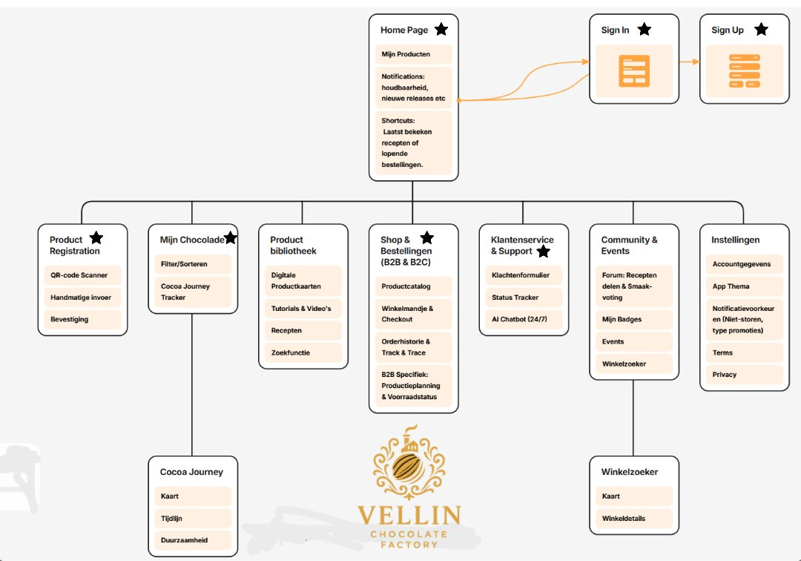

---

# 8. Wireframes

Hieronder worden de belangrijkste schermen van de Vellin app weergegeven. De wireframes dekken de must have user stories F01, F02, F03, F04 en F06. Dit vormt het MVP van de app. De overige pagina's uit de sitemap zoals de productbibliotheek, community, instellingen en notificaties vallen buiten het MVP en worden in een latere versie uitgewerkt.

## 1. Dashboard & Productregistratie ★

Dashboard met notificaties, geregistreerde producten en snelle toegang tot recepten en bestellingen. Producten kunnen via QR-code of handmatig worden geregistreerd.

**Gekoppeld aan:** F01, F02

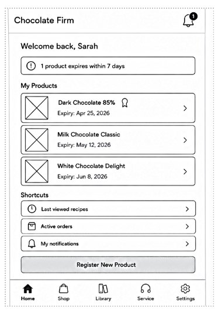

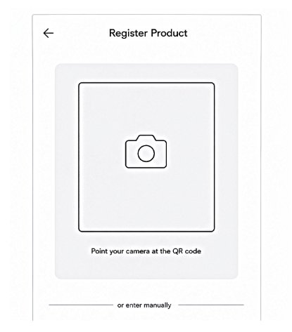

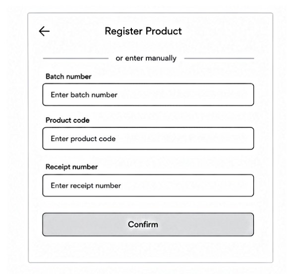

---

## 2. Mijn Chocolade & Productinformatie ★

Toont productinformatie, allergenen, certificeringen en de herkomst van cacao. Via de Cocoa Journey ziet de klant de volledige reis van het product en duurzaamheidsgegevens.

**Gekoppeld aan:** F01, F02

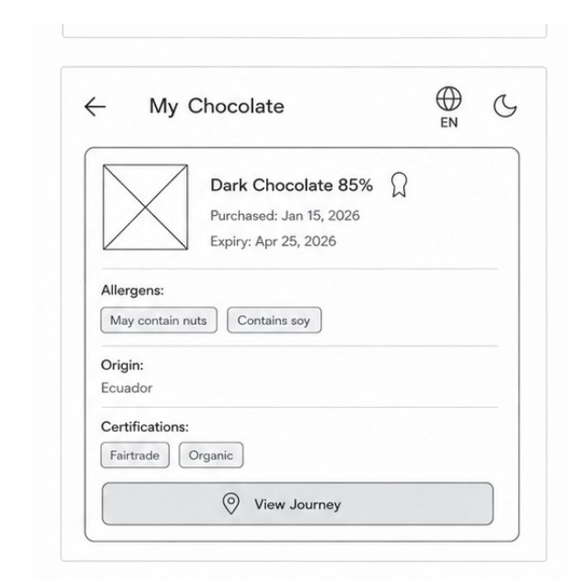

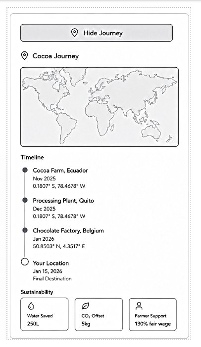

---

## 3. Support & Klachten (AI Chatbot) ★

Supportpagina met AI-chat en live chat voor vragen en klachten.

**Gekoppeld aan:** F03, F06

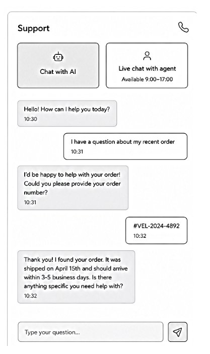

---

## 4. Shop (B2C & B2B) ★

Shop met zoekfunctie, filters en productoverzicht. De B2B-versie toont extra informatie zoals voorraad en levertijd.

**Gekoppeld aan:** F04

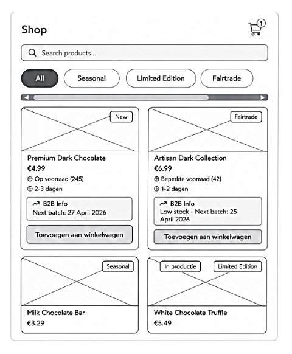

---

# MMM-labels

| Onderdeel | Toelichting |
| --- | --- |
| Organisatorische Context | AI gebruikt voor opmaak |
| Actoren | AI gebruikt voor opmaak |
| Bedrijfsprocesanalyse | AI gebruikt voor structuur |
| Productvisie | Geen gebruik gemaakt van AI-tools |
| User stories | AI gebruikt voor inspiratie |
| DoR & DoD | AI gebruikt voor structuur |
| Sitemap | Geen gebruik gemaakt van AI-tools |
| Wireframes | Samen met AI gemaakt |
